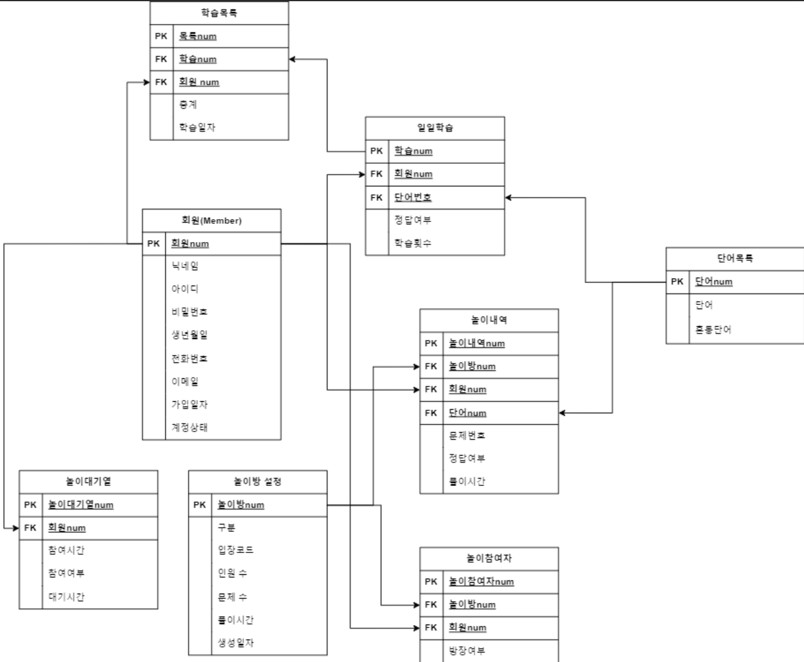

# 한글혜윰 서비스 기획

## 프로젝트 소개
- 게이미피케이션 형식을 활용한 맞춤법 학습앱

### ERD

### 프로토타입

[프로토타입 전체보기](https://www.figma.com/design/5mPTzOVGaLnoZ3CGZDs73b/%ED%95%9C%EA%B8%80%ED%97%A4%EC%9C%B0_front?node-id=186%3A11757&t=SI37IP3y5vvW35A6-1)

### API문서

### 회의록

