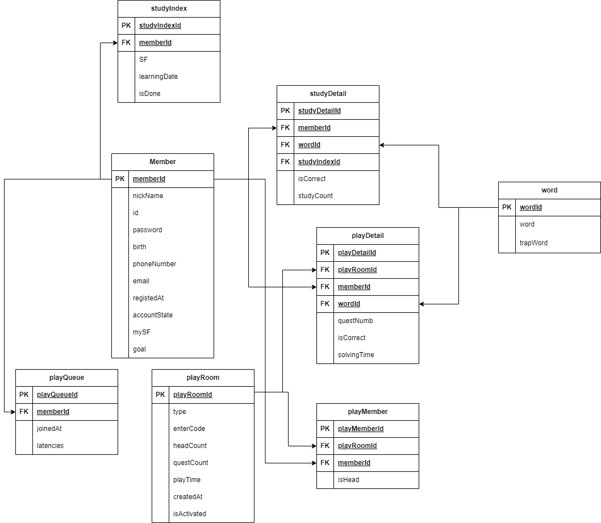

# 한글혜윰 서비스 기획

## 프로젝트 소개
- 게이미피케이션 형식을 활용한 맞춤법 학습앱
- 시간을 많이 투자할 수 없는 직장인들을 위해 간결하지만 알찬 맞춤법 학습을 가능하게 합니다.
 

### ERD

 

### 프로토타입

[프로토타입 전체보기](https://www.figma.com/design/5mPTzOVGaLnoZ3CGZDs73b/%ED%95%9C%EA%B8%80%ED%97%A4%EC%9C%B0_front?node-id=186%3A11757&t=SI37IP3y5vvW35A6-1)
 

### API문서
<!-- URL = 'file:///C:/Users/Admin/Desktop/chunjae_python/hyeyum-pjt/api_document_hyeyum.html' -->
[API문서 전체보기](https://www.notion.so/fc2834d19d854001906837513a3de4c8?v=bf886206904044479447a45388344fe9&pvs=4)
<!-- [API문서 전체보기](api_document_hyeyum.html) -->

 
### 회의록
[회의록 노션 바로가기](https://www.notion.so/6a9ead942b7b456f83f00667c587f8ca?v=1a966281c7f746c1b2af54dac2fea086)

